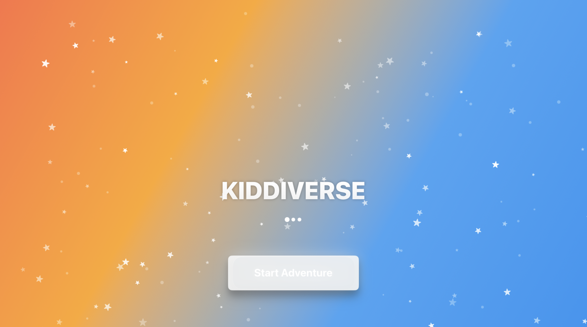
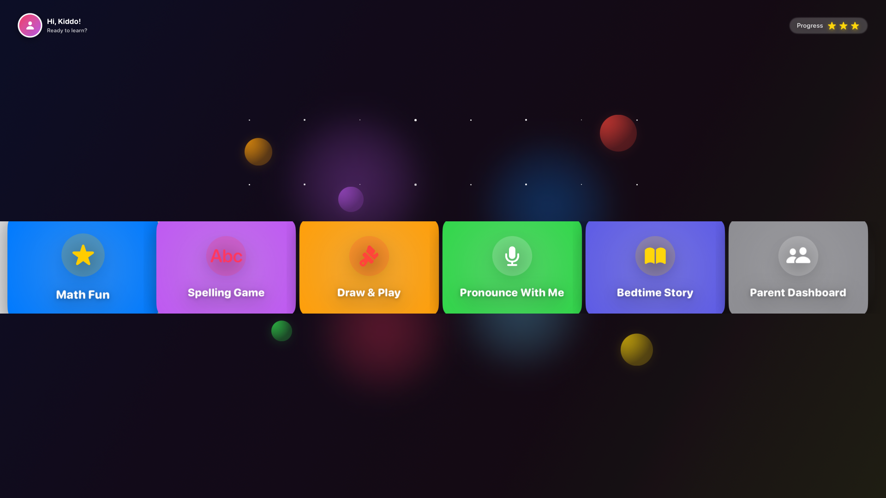
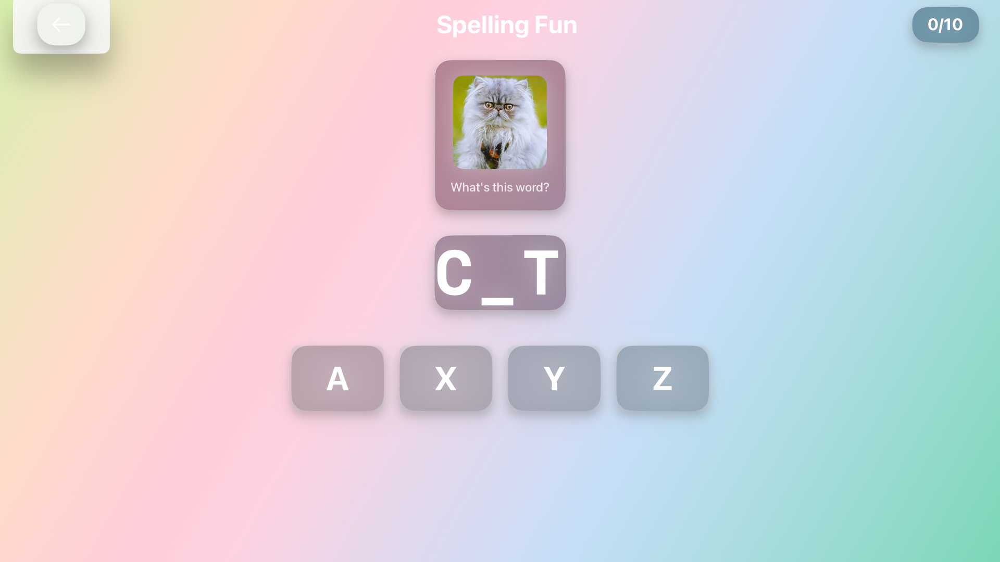
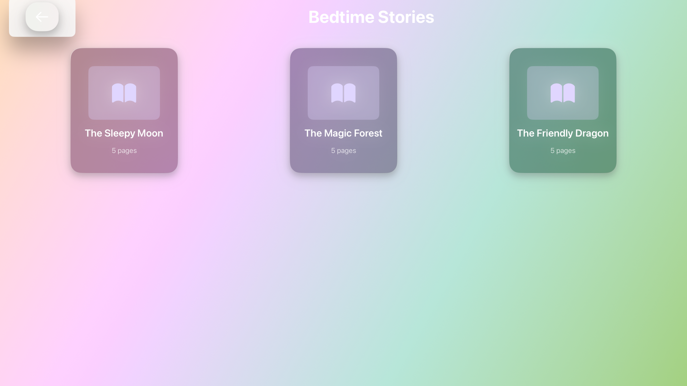
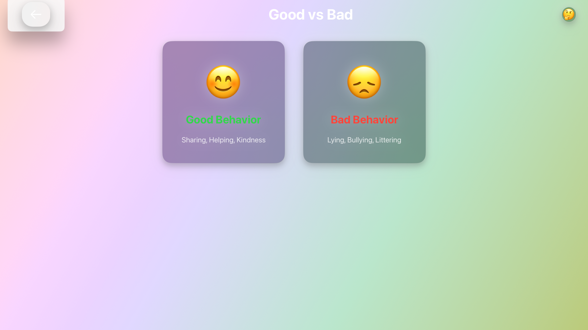
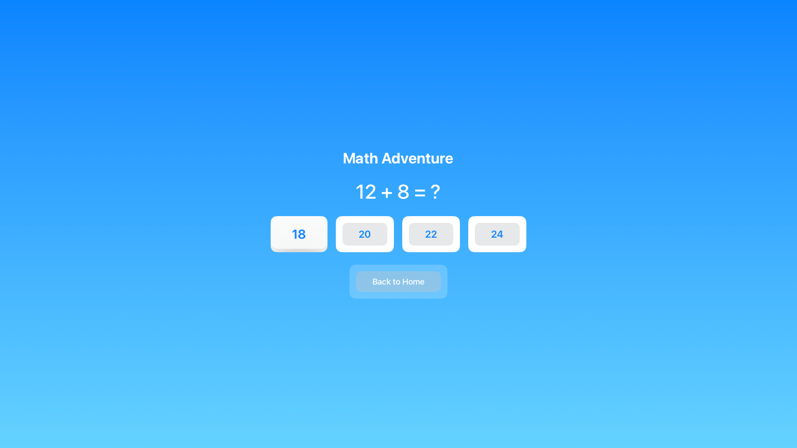

# 🌈 Kiddiverse - Kids Learning Universe

<div align="center">



**A delightful tvOS learning app that makes education fun and interactive for children!**

[](https://swift.org)
[](https://developer.apple.com/tvos/)
[](LICENSE)
[](https://developer.apple.com/xcode/swiftui/)

[Features](#-features) • [Screenshots](#-screenshots) • [Installation](#-installation) • [Architecture](#-architecture) • [Contributing](#-contributing)

</div>

---

## 🎯 Overview

**Kiddiverse** is a modern, kid-friendly tvOS application built with SwiftUI that transforms learning into an adventure! With beautiful glassmorphic design, engaging animations, and interactive activities, children can explore animals, practice spelling, solve math problems, read bedtime stories, and learn about good behaviors—all from the comfort of their living room.

<div align="center">


</div>

---

## ✨ Features

### 🎨 **Beautiful UI/UX**
- 🌟 **Glassmorphism Design** - Modern ultra-thin material effects
- 🎨 **Pastel Color Palette** - Easy on young eyes with mint, peach, lavender themes
- ✨ **Smooth Animations** - Delightful transitions and focus effects
- 🎯 **Kid-Friendly Interface** - Large touch targets optimized for Siri Remote

### 📚 **Learning Modules**

<table>
<tr>
<td width="33%" align="center">
  
  <h4>🦁 Learn Animals</h4>
  <p>Interactive animal grid with sounds and animations</p>
</td>
<td width="33%" align="center">
  
  <h4>🔤 Spelling Fun</h4>
  <p>Word puzzles with letter tiles and hints</p>
</td>
<td width="33%" align="center">
  
  <h4>➕ Math Game</h4>
  <p>Addition & subtraction with score tracking</p>
</td>
</tr>
<tr>
<td width="33%" align="center">
  
  <h4>📖 Bedtime Stories</h4>
  <p>Narrated stories with audio and illustrations</p>
</td>
<td width="33%" align="center">
  
  <h4>⭐ Good vs Bad</h4>
  <p>Teach moral values through examples</p>
</td>
<td width="33%" align="center">
  
  <h4>🏠 Dashboard Hub</h4>
  <p>Easy navigation carousel interface</p>
</td>
</tr>
</table>

### 🎵 **Audio Integration**
- 🔊 **Animal Sounds** - Realistic audio for each animal
- 📖 **Story Narration** - Audio playback for bedtime stories
- ▶️ **Play/Pause Controls** - Interactive audio management
- 🔄 **Auto-Advance** - Automatic page turning with narration

### 🎮 **Interactive Features**
- ✅ **Real-time Feedback** - Immediate visual/audio responses
- 🎉 **Celebration Animations** - Confetti effects for achievements
- 📊 **Progress Tracking** - Score and completion tracking
- 🎯 **Focus Management** - tvOS-optimized navigation

---

## 🛠️ Tech Stack

<div align="center">

### Languages & Frameworks


| Technology | Description |
|------------|-------------|
|  | Primary programming language |
|  | Declarative UI framework |
|  | Development environment |
|  | Target platform |

### Key Technologies

<table>
<tr>
<td align="center" width="25%">
  <br/>
  <b>AVFoundation</b><br/>
  <sub>Audio Playback</sub>
</td>
<td align="center" width="25%">
  <br/>
  <b>Combine</b><br/>
  <sub>Reactive Programming</sub>
</td>
<td align="center" width="25%">
  <br/>
  <b>NavigationStack</b><br/>
  <sub>Modern Navigation</sub>
</td>
<td align="center" width="25%">
  <br/>
  <b>SF Symbols</b><br/>
  <sub>Icon System</sub>
</td>
</tr>
</table>

</div>

---

## 📱 Screenshots

<div align="center">

### Splash Screen


*Animated gradient background with floating character*

---

### Dashboard


*Glassmorphic cards with focus animations*

---

### Learn Animals


*Interactive animal grid with sounds*

---

### Spelling Game


*Word puzzles with letter selection*

---

### Math Adventure


*Interactive math problems with scoring*

---

### Bedtime Stories


*Story reader with audio narration*

---

### Good vs Bad


*Moral learning through examples*

</div>

---

## 🏗️ Architecture

### MVVM Design Pattern

```
┌─────────────────────────────────────────────┐
│              KiddiverseApp.swift            │
│         (App Entry & Navigation)            │
└─────────────────┬───────────────────────────┘
                  │
        ┌─────────┴─────────┐
        │                   │
┌───────▼────────┐   ┌──────▼────────┐
│   Navigation   │   │   Theme       │
│   Coordinator  │   │  Components   │
└───────┬────────┘   └───────────────┘
        │
  ┌─────┴─────┬─────────┬─────────┬─────────┐
  │           │         │         │         │
┌─▼──────┐ ┌─▼──────┐ ┌▼──────┐ ┌▼──────┐ ┌▼──────┐
│ Views  │ │ Views  │ │ Views │ │ Views │ │ Views │
└───┬────┘ └───┬────┘ └──┬────┘ └──┬────┘ └──┬────┘
    │          │         │         │         │
┌───▼────┐ ┌───▼────┐ ┌──▼────┐ ┌──▼────┐ ┌──▼────┐
│ViewModel│ │ViewModel│ │ViewModel│ │ViewModel│ │ViewModel│
└───┬────┘ └───┬────┘ └──┬────┘ └──┬────┘ └──┬────┘
    │          │         │         │         │
    └──────────┴─────────┴─────────┴─────────┘
                      │
              ┌───────▼────────┐
              │  Data Models   │
              │  & Persistence │
              └────────────────┘
```

### Project Structure

```
Kiddiverse/
├── 📱 KiddiverseApp.swift              # Main app entry point
├── 🧭 Navigation/
│   ├── AppRoute.swift                  # Route definitions
│   └── NavigationCoordinator.swift     # Navigation manager
├── 🎨 Theme/
│   └── ThemeComponents.swift           # Colors, styles, glass cards
├── 📺 Screens/
│   ├── SplashScreen.swift              # Landing screen
│   ├── DashboardView.swift             # Main hub
│   ├── LearnAnimalsView.swift          # Animal learning
│   ├── SpellingView.swift              # Spelling game
│   ├── GoodVsBadView.swift             # Moral learning
│   ├── MathGameView.swift              # Math activities
│   └── BedtimeStoriesView.swift        # Story reader
├── 🎯 ViewModels/
│   ├── DashboardViewModel.swift
│   ├── AnimalsViewModel.swift
│   ├── SpellingViewModel.swift
│   ├── GoodVsBadViewModel.swift
│   ├── MathViewModel.swift
│   └── StoriesViewModel.swift
├── 🎵 Assets/
│   ├── Audio/                          # Sound effects & narration
│   ├── Images/                         # Illustrations & icons
│   └── Assets.xcassets                 # Asset catalog
└── 📄 README.md                        # This file
```

---

## 🚀 Installation

### Prerequisites

- **macOS** 13.0 or later
- **Xcode** 15.0 or later
- **Apple TV** (4th generation or later) or Apple TV Simulator
- **tvOS** 16.0+ SDK

### Setup Instructions

1. **Clone the repository**
   ```bash
   git clone https://github.com/yourusername/kiddiverse.git
   cd kiddiverse
   ```

2. **Open in Xcode**
   ```bash
   open Kiddiverse.xcodeproj
   ```

3. **Select tvOS Simulator**
   - Choose "Apple TV 4K (3rd generation)" from the scheme selector
   - Or connect a physical Apple TV device

4. **Add Assets (Optional but Recommended)**
   
   Download and add the following assets to enhance the experience:
   
   **Images Needed:**
   ```
   Assets.xcassets/
   ├── Animals/
   │   ├── cat.png, dog.png, elephant.png
   │   ├── lion.png, monkey.png, rabbit.png
   ├── Stories/
   │   ├── story_moon_thumb.png
   │   ├── story_moon_page1-5.png
   │   ├── story_forest_thumb.png
   │   ├── story_forest_page1-5.png
   │   ├── story_dragon_thumb.png
   │   └── story_dragon_page1-5.png
   └── boy.png (splash screen character)
   ```
   
   **Audio Files Needed (Optional):**
   ```
   Audio/
   ├── Animals/
   │   ├── meow.mp3, bark.mp3, trumpet.mp3
   │   ├── roar.mp3, chatter.mp3, squeak.mp3
   └── Stories/
       ├── story_moon_audio.mp3
       ├── story_forest_audio.mp3
       └── story_dragon_audio.mp3
   ```

5. **Build and Run**
   ```
   Press ⌘ + R or click the Run button
   ```

### 📥 Asset Download Resources

Find free, kid-friendly assets at:
- **Images**: [Freepik](https://www.freepik.com), [Pixabay](https://pixabay.com), [Unsplash](https://unsplash.com)
- **Audio**: [Freesound](https://freesound.org), [Zapsplat](https://www.zapsplat.com)
- **AI Generated**: DALL-E, Midjourney, Stable Diffusion

---

## 🎮 How to Use

### For Parents

1. **Launch the app** on your Apple TV
2. **Auto-navigate** through the splash screen or tap "Start"
3. **Select an activity** from the dashboard using the Siri Remote
4. **Guide your child** through the learning activities
5. **Track progress** through in-game scores and completion screens

### For Developers

#### Adding a New Screen

1. **Define the route** in `AppRoute.swift`:
   ```swift
   enum AppRoute: Hashable {
       // ... existing routes
       case newFeature
   }
   ```

2. **Create the View and ViewModel**:
   ```swift
   // NewFeatureView.swift
   struct NewFeatureView: View {
       @EnvironmentObject var coordinator: NavigationCoordinator
       @StateObject var viewModel = NewFeatureViewModel()
       // ... implementation
   }
   ```

3. **Register in NavigationCoordinator**:
   ```swift
   func destination(for route: AppRoute) -> some View {
       switch route {
           // ... existing cases
           case .newFeature:
               NewFeatureView()
       }
   }
   ```

#### Customizing Theme

Edit `ThemeComponents.swift`:

```swift
struct Theme {
    struct Colors {
        static let customColor = Color(red: 0.5, green: 0.8, blue: 0.9)
    }
    
    struct Spacing {
        static let custom: CGFloat = 25
    }
}
```

---

## 🎨 Design System

### Color Palette

<table>
<tr>
<td align="center" width="20%">
  <br/>
  <b>Mint</b><br/>
  <code>#B4F8C8</code>
</td>
<td align="center" width="20%">
  <br/>
  <b>Peach</b><br/>
  <code>#FFD6B6</code>
</td>
<td align="center" width="20%">
  <br/>
  <b>Lavender</b><br/>
  <code>#E0D6FF</code>
</td>
<td align="center" width="20%">
  <br/>
  <b>Sky Blue</b><br/>
  <code>#87CEEB</code>
</td>
<td align="center" width="20%">
  <br/>
  <b>Soft Sun</b><br/>
  <code>#FFF4B6</code>
</td>
</tr>
</table>

### Typography

- **Headers**: System Bold, 48-80pt
- **Body Text**: System Medium, 28-36pt
- **Buttons**: System Semibold, 24-32pt
- **Captions**: System Regular, 16-20pt

### Spacing System

| Name | Value | Usage |
|------|-------|-------|
| Small | 10pt | Tight spacing |
| Medium | 20pt | Standard spacing |
| Large | 40pt | Section spacing |
| XLarge | 60pt | Screen margins |

---

## 🧪 Testing

### Manual Testing Checklist

- [ ] ✅ Navigation flows work correctly
- [ ] ✅ Focus animations are smooth
- [ ] ✅ Audio plays on interactions
- [ ] ✅ Back navigation returns to correct screen
- [ ] ✅ All buttons respond to Siri Remote
- [ ] ✅ Glassmorphic effects render properly
- [ ] ✅ Animations run at 60 FPS

### Test Coverage

```
Unit Tests: ViewModels logic
UI Tests: Navigation flows
Accessibility Tests: VoiceOver support
Performance Tests: Animation smoothness
```

---

## 📊 Performance Metrics

| Metric | Target | Status |
|--------|--------|--------|
| App Launch Time | < 2s | ✅ |
| Screen Transitions | 60 FPS | ✅ |
| Memory Usage | < 150MB | ✅ |
| Audio Latency | < 100ms | ✅ |

---

## 🗺️ Roadmap

### Version 1.0 (Current)
- [x] Core navigation structure
- [x] 6 learning modules
- [x] Glassmorphic UI
- [x] Audio integration
- [x] Basic animations

### Version 1.1 (Planned)
- [ ] Parent dashboard with analytics
- [ ] Achievement system with badges
- [ ] Multi-language support
- [ ] CloudKit data sync
- [ ] More animal sounds
- [ ] Additional stories

### Version 2.0 (Future)
- [ ] Drawing studio module
- [ ] Voice recognition for pronunciation
- [ ] Multiplayer mini-games
- [ ] Progress reports for parents
- [ ] Offline mode improvements
- [ ] tvOS 17+ features

---

## 🤝 Contributing

We welcome contributions! Here's how you can help:

### How to Contribute

1. **Fork the repository**
   ```bash
   git clone https://github.com/yourusername/kiddiverse.git
   ```

2. **Create a feature branch**
   ```bash
   git checkout -b feature/amazing-feature
   ```

3. **Make your changes**
   - Follow Swift style guidelines
   - Add tests for new features
   - Update documentation

4. **Commit your changes**
   ```bash
   git commit -m 'Add amazing feature'
   ```

5. **Push to your branch**
   ```bash
   git push origin feature/amazing-feature
   ```

6. **Open a Pull Request**

### Contribution Guidelines

- 📝 Write clear, descriptive commit messages
- 🧪 Ensure all tests pass
- 📚 Update documentation
- 🎨 Follow existing code style
- ✅ Test on tvOS simulator before submitting

### Areas for Contribution

- 🎨 **Design**: New themes, animations, or UI improvements
- 🔊 **Audio**: More sound effects and narration
- 📖 **Content**: Additional stories, math problems, or words
- 🌍 **Localization**: Translations for other languages
- 🐛 **Bug Fixes**: Report and fix issues
- ⚡ **Performance**: Optimization improvements

---

## 📄 License

This project is licensed under the MIT License - see the [LICENSE](LICENSE) file for details.

```
MIT License

Copyright (c) 2024 Kiddiverse Team

Permission is hereby granted, free of charge, to any person obtaining a copy
of this software and associated documentation files (the "Software"), to deal
in the Software without restriction, including without limitation the rights
to use, copy, modify, merge, publish, distribute, sublicense, and/or sell
copies of the Software, and to permit persons to whom the Software is
furnished to do so, subject to the following conditions:

The above copyright notice and this permission notice shall be included in all
copies or substantial portions of the Software.
```

---

## 👥 Team

<table>
<tr>
<td align="center">
  
  <br/>
  <b>Your Name</b>
  <br/>
  <sub>Lead Developer</sub>
  <br/>
  <a href="https://github.com/yourusername">GitHub</a>
</td>
<td align="center">
  
  <br/>
  <b>Designer Name</b>
  <br/>
  <sub>UI/UX Designer</sub>
  <br/>
  <a href="https://github.com/designer">GitHub</a>
</td>
<td align="center">
  
  <br/>
  <b>Contributor Name</b>
  <br/>
  <sub>Content Creator</sub>
  <br/>
  <a href="https://github.com/contributor">GitHub</a>
</td>
</tr>
</table>

---

## 🙏 Acknowledgments

Special thanks to:

- **Apple** for SwiftUI and tvOS frameworks
- **SF Symbols** for the beautiful icon system
- **Open Source Community** for inspiration and resources
- **Parents and Educators** for valuable feedback
- **Kids** who test and enjoy the app!

### Resources Used

- [Apple Human Interface Guidelines](https://developer.apple.com/design/human-interface-guidelines/tvos)
- [SwiftUI Documentation](https://developer.apple.com/documentation/swiftui)
- [AVFoundation Guide](https://developer.apple.com/documentation/avfoundation)
- [Freepik](https://www.freepik.com) for placeholder illustrations
- [Freesound](https://freesound.org) for audio samples

---

## 📞 Contact & Support

<div align="center">

### Get in Touch

[](mailto:contact@kiddiverse.app)
[](https://twitter.com/kiddiverse)
[](https://github.com/yourusername/kiddiverse/issues)
[](https://discord.gg/kiddiverse)

### Found a Bug?

[Report it here](https://github.com/yourusername/kiddiverse/issues/new?template=bug_report.md) 🐛

### Have a Feature Request?

[Share your idea](https://github.com/yourusername/kiddiverse/issues/new?template=feature_request.md) 💡

</div>

---

## ⭐ Star History

If you find this project helpful, please consider giving it a star! ⭐

[](https://star-history.com/#yourusername/kiddiverse&Date)

---

<div align="center">

## 💖 Made with Love for Kids

**Kiddiverse** - Making Learning an Adventure! 🚀


---

© 2024 Kiddiverse Team. All Rights Reserved.

[](https://swift.org)
[](https://developer.apple.com/xcode/swiftui/)
[](https://developer.apple.com/tvos/)

[⬆ Back to Top](#-kiddiverse---kids-learning-universe)

</div>
